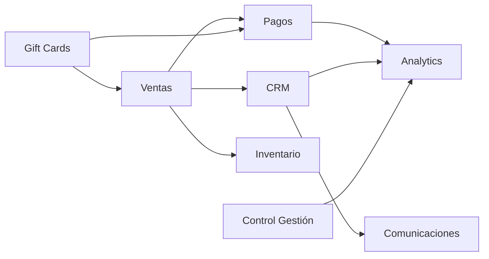

# 📦 Módulos del Sistema - Aremko Booking System

## 📑 Tabla de Contenidos

- [Visión General](#visión-general)
- [Módulo de Ventas y Reservas](#módulo-de-ventas-y-reservas)
- [Módulo de Gift Cards](#módulo-de-gift-cards)
- [Módulo CRM](#módulo-crm)
- [Módulo de Pagos](#módulo-de-pagos)
- [Módulo de Analytics](#módulo-de-analytics)
- [Módulo de Inventario](#módulo-de-inventario)
- [Módulo de Control de Gestión](#módulo-de-control-de-gestión)
- [Módulo de Comunicaciones](#módulo-de-comunicaciones)
- [Integraciones entre Módulos](#integraciones-entre-módulos)

## 🎯 Visión General

El sistema está organizado en módulos funcionales que trabajan de manera integrada. Cada módulo tiene responsabilidades específicas y se comunica con otros a través de interfaces bien definidas.

```
┌─────────────────────────────────────────────────────────┐
│                    AREMKO BOOKING SYSTEM                 │
├──────────────┬──────────────┬──────────────┬───────────┤
│   Ventas &   │     CRM &    │   Pagos &    │Analytics &│
│   Reservas   │   Marketing  │  Finanzas    │ Reportes  │
├──────────────┼──────────────┼──────────────┼───────────┤
│  Gift Cards  │  Inventario  │Control       │  Comunic. │
│              │              │Gestión       │           │
└──────────────┴──────────────┴──────────────┴───────────┘
```

## 🛒 Módulo de Ventas y Reservas

### Descripción
Core del sistema que gestiona todo el proceso de venta de servicios y productos, desde la selección hasta la confirmación de la reserva.

### Componentes Principales

#### Modelos
```python
# ventas/models.py
- Servicio           # Servicios ofrecidos (masajes, tinas, alojamiento)
- CategoriaServicio  # Categorización de servicios
- VentaReserva       # Reservas realizadas
- ReservaServicio    # Detalle de servicios en cada reserva
- ReservaProducto    # Productos incluidos en reservas
- Horario            # Configuración de horarios disponibles
```

#### Vistas
```python
# ventas/views/
- public_views.py    # Catálogo público, homepage
- checkout_views.py  # Proceso de compra y carrito
- availability_views.py  # Consulta de disponibilidad
```

### Funcionalidades

1. **Catálogo de Servicios**
   - Listado por categorías
   - Filtros y búsqueda
   - Información detallada
   - Galería de imágenes

2. **Sistema de Disponibilidad**
   - Calendario interactivo
   - Verificación en tiempo real
   - Bloqueo de slots ocupados
   - Gestión de capacidad

3. **Carrito de Compras**
   - Múltiples servicios/productos
   - Cálculo automático de descuentos
   - Validación de disponibilidad
   - Persistencia de sesión

4. **Checkout**
   - Formulario de datos del cliente
   - Selección de método de pago
   - Aplicación de gift cards
   - Confirmación de reserva

### Configuración

```python
# Ejemplo de configuración de servicio
servicio = Servicio(
    nombre="Masaje Relajación 60min",
    categoria=categoria_masajes,
    duracion=60,  # minutos
    precio=45000,
    capacidad_min=1,
    capacidad_max=1,
    slots_disponibles={
        "lunes": ["10:00", "11:30", "15:00"],
        "martes": ["10:00", "11:30", "15:00"],
        # ...
    }
)
```

## 🎁 Módulo de Gift Cards

### Descripción
Gestión completa de gift cards digitales, desde la venta hasta la redención.

### Componentes

#### Modelos
```python
- GiftCard            # Gift card vendida
- GiftCardRedencion   # Uso de gift card
- ExperienciaGiftCard # Tipos de experiencias disponibles
```

#### Servicios
```python
# ventas/services/giftcard_pdf_service.py
- GiftCardPDFService  # Generación de PDFs personalizados
```

### Funcionalidades

1. **Venta de Gift Cards**
   - Wizard de compra paso a paso
   - Múltiples experiencias disponibles
   - Personalización (para/de/mensaje)
   - Montos fijos o personalizados

2. **Generación de PDFs**
   - Diseño profesional
   - Código QR único
   - Información de redención
   - Marca de agua de seguridad

3. **Sistema de Códigos**
   - Códigos únicos de 8 caracteres
   - Validación de unicidad
   - Prevención de fraude

4. **Redención**
   - Validación en checkout
   - Seguimiento de saldo
   - Historial de uso
   - Reportes de gift cards

### Ejemplo de Uso

```python
# Crear gift card
gift_card = GiftCard.objects.create(
    codigo="ABCD1234",
    monto_inicial=100000,
    monto_disponible=100000,
    comprador_nombre="Juan Pérez",
    comprador_email="juan@email.com",
    para_nombre="María García",
    mensaje_personal="¡Feliz cumpleaños!"
)

# Generar PDF
from ventas.services.giftcard_pdf_service import GiftCardPDFService
pdf_service = GiftCardPDFService()
pdf_buffer = pdf_service.generate_mobile_pdf(gift_card)
```

## 👥 Módulo CRM

### Descripción
Gestión de relaciones con clientes, segmentación y campañas de marketing.

### Componentes

#### Modelos
```python
- Cliente              # Información de clientes
- ClienteSegmentacion  # Segmentos de clientes
- EmailCampaign        # Campañas de email
- EmailRecipient       # Destinatarios de campañas
- Premio               # Premios otorgados
- CommunicationLog     # Registro de comunicaciones
```

#### Vistas
```python
# ventas/views/
- crm_views.py         # Dashboard CRM
- email_campaign_views.py  # Gestión de campañas
```

### Funcionalidades

1. **Gestión de Clientes**
   - Perfil 360° del cliente
   - Historial de compras
   - Preferencias de comunicación
   - Segmentación automática

2. **Segmentación**
   ```python
   # Segmentos automáticos
   - Nuevos (0-3 meses)
   - Regulares (3+ visitas)
   - VIP (alto gasto)
   - Inactivos (90+ días)
   ```

3. **Campañas de Email**
   - Editor visual
   - Plantillas personalizables
   - Variables dinámicas
   - Programación de envíos

4. **Sistema de Premios**
   - Premios automáticos por hitos
   - Gift cards de fidelización
   - Tracking de uso

### Automatizaciones

```python
# Triggers automáticos
- Bienvenida (primera compra)
- Cumpleaños
- Reactivación (90 días sin compra)
- Post-servicio (encuesta satisfacción)
- Hitos de gasto
```

## 💰 Módulo de Pagos

### Descripción
Gestión integral de pagos, integraciones con pasarelas y control financiero.

### Componentes

#### Modelos
```python
- Pago                 # Pagos realizados
- MetodoPago           # Métodos disponibles
- PagoMasajista        # Pagos a proveedores
- RegistroPagoMasajista # Historial de pagos
```

#### Integraciones
```python
# Flow.cl
- FlowPaymentService   # Procesamiento con Flow
- FlowWebhookHandler   # Manejo de notificaciones

# Mercado Pago
- MercadoPagoService   # Procesamiento con MP
```

### Funcionalidades

1. **Procesamiento de Pagos**
   - Múltiples métodos de pago
   - Pagos parciales
   - Confirmación automática
   - Manejo de errores

2. **Integración Flow.cl**
   ```python
   # Flujo de pago
   1. Crear orden → 2. Redirección → 3. Pago en Flow
   4. Webhook confirmación → 5. Actualizar reserva
   ```

3. **Gestión de Comisiones**
   - Cálculo automático
   - Reportes de comisiones
   - Interface de pago a proveedores

4. **Conciliación**
   - Matching automático
   - Reportes de discrepancias
   - Auditoría de transacciones

### Configuración de Pagos

```python
# Métodos de pago disponibles
METODOS_PAGO = [
    ('transferencia', 'Transferencia Bancaria'),
    ('flow', 'Flow (Webpay, Servipag, etc)'),
    ('mercadopago', 'Mercado Pago'),
    ('efectivo', 'Efectivo'),
    ('giftcard', 'Gift Card'),
]
```

## 📊 Módulo de Analytics

### Descripción
Dashboards, reportes y análisis de datos para la toma de decisiones.

### Componentes

#### Vistas
```python
# ventas/views/analytics_views.py
- DashboardVentas      # KPIs de ventas
- DashboardOperativo   # Métricas operativas
- DashboardGiftCards   # Análisis de gift cards
- ReportesPersonalizados
```

### Dashboards Disponibles

1. **Dashboard de Ventas**
   - Ventas del día/mes/año
   - Comparativas período anterior
   - Top servicios/productos
   - Análisis por categoría

2. **Dashboard Operativo**
   - Ocupación por servicio
   - Productividad masajistas
   - Tiempos de servicio
   - Satisfacción clientes

3. **Dashboard Gift Cards**
   - Ventas vs redenciones
   - Saldos pendientes
   - Análisis de vigencia
   - Patrones de uso

### Reportes

```python
# Reportes disponibles
- Servicios vendidos (Excel)
- Productos vendidos (Excel)
- Caja diaria
- Comisiones masajistas
- Análisis de clientes
- Proyecciones
```

### Métricas Clave (KPIs)

```python
# KPIs principales
- Ticket promedio
- Tasa de conversión
- Ocupación promedio
- Cliente lifetime value
- Tasa de retención
- NPS (Net Promoter Score)
```

## 📦 Módulo de Inventario

### Descripción
Control de stock de productos vendibles y gestión de movimientos.

### Componentes

#### Modelos
```python
- Producto             # Productos vendibles
- MovimientoInventario # Entradas/salidas
- AjusteInventario     # Ajustes manuales
```

#### Funcionalidades

1. **Gestión de Productos**
   - ABM de productos
   - Control de stock
   - Alertas de stock bajo
   - Trazabilidad

2. **Movimientos**
   - Registro automático en ventas
   - Ajustes manuales
   - Devoluciones
   - Mermas

3. **Reportes de Inventario**
   - Stock actual
   - Movimientos del período
   - Valorización
   - Rotación de productos

## 🎛️ Módulo de Control de Gestión

### Descripción
Herramientas para la gestión operativa diaria del spa.

### Componentes

#### App Separada
```python
# control_gestion/
- models.py      # Modelos específicos
- services.py    # Lógica de análisis
- views.py       # Interfaces de gestión
- tasks.py       # Tareas programadas
```

### Funcionalidades

1. **Agenda Operativa**
   - Vista diaria de servicios
   - Asignación de recursos
   - Control de tiempos
   - Gestión de imprevistos

2. **Control de Calidad**
   - Checklists de servicio
   - Registro de incidencias
   - Seguimiento de mejoras

3. **Gestión de Personal**
   - Horarios de trabajo
   - Productividad
   - Comisiones
   - Evaluaciones

4. **Análisis Predictivo**
   - Proyección de demanda
   - Optimización de recursos
   - Sugerencias de mejora

## 📱 Módulo de Comunicaciones

### Descripción
Gestión unificada de todas las comunicaciones con clientes.

### Componentes

#### Modelos
```python
- SMSTemplate          # Plantillas SMS
- CommunicationLog     # Log de comunicaciones
- CommunicationLimit   # Límites anti-spam
```

#### Servicios
```python
# ventas/services/
- communication_service.py  # Lógica de envío
- email_service.py         # Emails transaccionales
```

### Canales de Comunicación

1. **Email (SendGrid)**
   - Transaccionales
   - Marketing
   - Automatizados

2. **SMS (Futuro)**
   - Confirmaciones
   - Recordatorios
   - Alertas

3. **WhatsApp (Futuro)**
   - Soporte
   - Notificaciones
   - Marketing

### Tipos de Comunicaciones

```python
TIPOS_COMUNICACION = [
    # Transaccionales
    'confirmacion_reserva',
    'recordatorio_24h',
    'confirmacion_pago',

    # Marketing
    'campana_email',
    'reactivacion_90d',
    'cumpleanos',

    # Post-servicio
    'encuesta_satisfaccion',
    'solicitud_resena',
]
```

## 🔗 Integraciones entre Módulos

### Flujos de Datos



### Eventos del Sistema

```python
# Signals principales
- post_save VentaReserva → Actualizar cliente
- post_save Pago → Confirmar reserva
- post_save Cliente → Segmentación automática
- pre_save GiftCard → Generar código único
```

### APIs Internas

```python
# Endpoints de integración
/api/internal/
├── availability/check/
├── customer/segment/
├── payment/process/
├── giftcard/validate/
├── inventory/update/
└── analytics/track/
```

## 🚀 Mejoras Futuras por Módulo

### Ventas y Reservas
- [ ] Reservas recurrentes
- [ ] Lista de espera automática
- [ ] Recomendaciones AI

### CRM
- [ ] Lead scoring
- [ ] Automatización avanzada
- [ ] Integración redes sociales

### Pagos
- [ ] Más pasarelas de pago
- [ ] Criptomonedas
- [ ] Buy now, pay later

### Analytics
- [ ] Machine Learning
- [ ] Dashboards personalizables
- [ ] Alertas inteligentes

---

<p align="center">
  Documentación actualizada: Febrero 2026
</p>